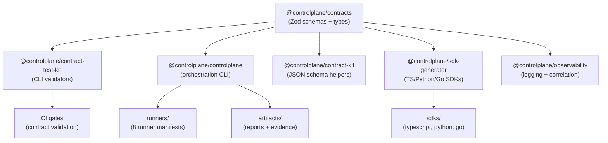

# ControlPlane Contracts & Tooling

[](https://github.com/Hardonian/ControlPlane/actions/workflows/verify-integrations.yml)
[](https://github.com/Hardonian/ControlPlane/actions/workflows/ci.yml)
[](./LICENSE)

Contract-first ecosystem for ControlPlane-compatible services and runners. Ships canonical [Zod](https://zod.dev/) schemas, validation CLIs, runner scaffolding, and compatibility tooling — **not** a runtime service.

**Who this is for:** platform engineers, SDK authors, and contributors building ControlPlane-compatible components.

---

## What It Does

| Capability | Package | What you get |
|---|---|---|
| Canonical schemas | `@controlplane/contracts` | Zod schemas, TypeScript types, error envelopes |
| Contract validation | `@controlplane/contract-test-kit` | CLI to validate implementations against schemas |
| Orchestration CLI | `@controlplane/controlplane` | `plan`, `run`, `doctor` commands for runners |
| Runner scaffolding | `@controlplane/create-runner` | Interactive generator for new runners |
| SDK generation | `@controlplane/sdk-generator` | Generate TypeScript, Python, Go SDKs from contracts |
| Observability | `@controlplane/observability` | Pino-based structured logging + correlation IDs |
| Benchmarking | `@controlplane/benchmark` | Performance test harnesses |

## What This Is NOT

- Not a running orchestration service or hosted platform.
- Does not include implementations of TruthCore, JobForge, or production runners.
- Does not retain ownership of artifacts or data processed by consuming services.

---

## Quick Start

### Prerequisites

- **Node.js** >= 18.0.0
- **pnpm** >= 8.0.0

### Install, Build, Verify

```bash
# 1. Install dependencies
pnpm install

# 2. Build all packages
pnpm run build

# 3. Run diagnostics — confirms Node, pnpm, builds, schemas, runners
pnpm run doctor

# 4. Run all unit tests
pnpm run test

# 5. Validate contracts against schemas
pnpm run contracts:check
```

### Expected Output: `pnpm run doctor`

```
ControlPlane Doctor
==================================================
  [OK  ] node-version: Node v22.22.0
  [OK  ] pnpm: pnpm 8.12.0
  [OK  ] dependencies: node_modules present
  [OK  ] build:packages/contracts/dist: dist present
  [OK  ] build:packages/contract-kit/dist: dist present
  [OK  ] build:packages/controlplane/dist: dist present
  [OK  ] build:packages/contract-test-kit/dist: dist present
  [OK  ] runners: 8 runner(s) discovered
  [OK  ] schemas: 7/7 schemas present
  [OK  ] golden-fixture: Golden input fixture present
  [INFO] env:NODE_ENV: Not set (optional)
  [OK  ] module-manifest: module.manifest.json present

Status: HEALTHY (12 checks, 0 failures, 0 warnings)
```

### Expected Output: `pnpm run contracts:check`

```
Contracts Check Results
==================================================
  [PASS] runner-manifest:JobForge
  [PASS] runner-manifest:truthcore
  ...
  [PASS] schema:reports.schema.json
  [PASS] schema:evidence.schema.json
  [PASS] contracts-package
  [PASS] module-manifest:ControlPlane

18 checks, 0 failures
```

---

## Environment Variables

Use `.env.example` as the canonical list of environment variables for local workflows and templates. For deployment guidance, see [docs/DEPLOYMENT.md](./docs/DEPLOYMENT.md). Security posture is documented in [docs/SECURITY.md](./docs/SECURITY.md).

### Demo Mode (Deterministic, Offline)

```bash
pnpm run demo:reset
pnpm run demo:start
```

Artifacts are written to `demo/` with a fixed timestamp (override via `CONTROLPLANE_DEMO_TIME`).

## Architecture Overview

### Orchestration (`controlplane`)

| Command | Description |
|---|---|
| `pnpm run controlplane:plan` | Generate an execution plan (dry-run). Shows runners, schemas, and execution steps as JSON. |
| `pnpm run controlplane:run:smoke` | Execute smoke run. Invokes runners with golden fixture input. |
| `pnpm run controlplane:doctor` | Deep health check. JSON output with builds, schemas, runners, compatibility status. |

### Validation

| Command | Description |
|---|---|
| `pnpm run doctor` | Quick health check (Node, pnpm, builds, schemas, runners) |
| `pnpm run contracts:check` | Validate all runner manifests and contract schemas |
| `pnpm run contract:lint` | Lint contract source files |
| `pnpm run compat:generate` | Regenerate `docs/COMPATIBILITY.md` |
| `pnpm run compat:check` | Strict compatibility check (fails on drift) |
| `pnpm run distribution:verify` | Verify OSS/cloud boundary flags |

### Build & Test

| Command | Description |
|---|---|
| `pnpm run build` | Build all packages (via Turborepo) |
| `pnpm run test` | Run all unit tests (via Turborepo) |
| `pnpm run test:integration` | Integration tests |
| `pnpm run test:e2e` | Playwright E2E tests (requires local stack) |
| `pnpm run test:smoke` | Smoke test (health verification) |
| `pnpm run lint` | ESLint across all packages |
| `pnpm run typecheck` | TypeScript type checking |
| `pnpm run verify` | Full verification: lint + typecheck + test + build + docs |
| `pnpm run ci` | Full CI pipeline: lint + typecheck + test + build + E2E |

### Local Development Stack

```bash
pnpm run dev:stack          # Start Docker services (detached)
pnpm run dev:stack:logs     # Start with logs visible
pnpm run dev:stack:down     # Stop and remove containers
pnpm run dev                # Watch mode for all packages
```

---

## Contract Guarantees

These are the promises this repo makes to consumers:

1. **Backwards compatibility within major versions.** Contract schemas do not remove or narrow fields within the same major version. Additive changes only.
2. **Deterministic validation.** The same input to `contracts:check` always produces the same pass/fail result.
3. **Schema-first authority.** The JSON schemas in `contracts/` and Zod schemas in `packages/contracts/src/` are the single source of truth. If code and docs disagree, the schema wins.
4. **Error envelopes stay parseable.** Error shapes (`{code, message, details?}`) do not change structure within a major version.
5. **No placeholder content.** Every documented command, file path, and example in this repo must be runnable and real.

---

## Artifact Format

Runners produce two artifact types, validated against JSON schemas in `contracts/`.

### Report (`contracts/reports.schema.json`)

```jsonc
{
  "runner": { "name": "JobForge", "version": "0.1.0" },
  "status": "success",         // "success" | "failed" | "degraded"
  "startedAt": "2025-01-01T00:00:00Z",
  "finishedAt": "2025-01-01T00:01:00Z",
  "summary": "Human-readable result summary",
  "metrics": { "durationMs": 60000 },     // optional
  "artifacts": [{ "name": "...", "path": "...", "mediaType": "..." }],  // optional
  "errors": [{ "code": "...", "message": "..." }]  // optional, on failure
}
```

### Evidence Packet (`contracts/evidence.schema.json`)

```jsonc
{
  "id": "unique-id",
  "runner": "JobForge",
  "timestamp": "2025-01-01T00:00:00Z",
  "hash": "sha256-of-canonical-items",     // SHA-256 of canonical JSON of items array
  "contractVersion": "1.0.0",
  "items": [
    { "key": "check-name", "value": true, "source": "api-call", "redacted": false }
  ],
  "decision": {                            // optional
    "outcome": "pass",                     // "pass" | "fail" | "uncertain" | "skip"
    "reasons": [{ "ruleId": "...", "message": "..." }],
    "confidence": 0.95
  }
}
```

### Runner Manifest (`contracts/runner.manifest.schema.json`)

Every runner must have a `runner.manifest.json`:

```jsonc
{
  "name": "my-runner",
  "version": "0.1.0",
  "description": "What this runner does",
  "entrypoint": {
    "command": "node",
    "args": ["dist/cli.js"]
  },
  "capabilities": ["adapter", "dry-run"],  // optional
  "requiredEnv": [],                        // optional
  "outputs": ["report", "evidence"]         // optional
}
```

Artifacts are written to `artifacts/<runner>/<timestamp>/` during execution.

---

## Architecture

```
packages/
  contracts/            # SOURCE OF TRUTH: Zod schemas, types, error envelopes
  contract-kit/         # JSON schema validation helpers
  contract-test-kit/    # CLI validators, registry generation, marketplace
  controlplane/         # Orchestration CLI (plan / run / doctor)
  create-runner/        # Interactive runner scaffolding generator
  observability/        # Pino-based logging + correlation IDs
  sdk-generator/        # SDK generation (TypeScript, Python, Go)
  benchmark/            # Performance benchmarking suite
  optimization-utils/   # Caching, hardening, monitoring utilities
  integration-tests/    # Integration test suite
contracts/              # JSON Schemas (reports, evidence, runner manifest, etc.)
runners/                # Runner manifests (8 runners: JobForge, truthcore, etc.)
scripts/                # Validation, diagnostics, release utilities
config/                 # OSS/Cloud distribution flags
tests/                  # E2E, integration, golden-fixture tests
```



See [docs/ARCHITECTURE.md](./docs/ARCHITECTURE.md) for the full architecture reference.

---

## Module Discovery & Integration

ControlPlane automatically discovers and loads modules from multiple sources with graceful fallback:

### Discovery Sources (Priority Order)

1. **Workspace Packages** (`packages/`) - Local monorepo packages
2. **Installed Packages** (`node_modules/`) - Published npm packages
3. **Runner Manifests** (`runners/`) - Fallback manifest-based runners

### Adding a New Module

#### Option 1: Workspace Package
```bash
# Create package structure
mkdir packages/my-runner
cd packages/my-runner

# Create package.json
{
  "name": "@controlplane/my-runner",
  "version": "1.0.0",
  "main": "./dist/index.js",
  "exports": { ".": "./dist/index.js" }
}

# Implement runner logic
# Build and export runner function
```

#### Option 2: Installed Package
```bash
# Publish your runner as npm package
npm publish

# Install in ControlPlane
pnpm add @my-org/my-runner

# ControlPlane will auto-discover it
```

#### Option 3: Manifest-Based Runner
```bash
# Create runner directory
mkdir runners/my-runner

# Create manifest
# runners/my-runner/runner.manifest.json
{
  "name": "my-runner",
  "version": "1.0.0",
  "entrypoint": {
    "command": "node",
    "args": ["scripts/adapters/runner-adapter.mjs", "--runner", "my-runner"]
  }
}
```

### Graceful Degradation

If a module is unavailable, ControlPlane:
- Shows actionable error messages
- Continues execution with available modules
- Provides next-step commands for resolution

### Testing Integration

```bash
# Run full pipeline demo
pnpm controlplane run demo

# Check module registry
pnpm controlplane list

# Verify ecosystem health
pnpm controlplane doctor
```

---

## Contribution Workflow

1. Fork or branch from `main`.
2. Pick a [contribution lane](./CONTRIBUTING.md#contribution-lanes) (docs / runner / connector / contracts).
3. Make changes. Keep diffs small and focused.
4. Run verification:
   ```bash
   pnpm run verify   # lint + typecheck + test + build + docs
   ```
5. Commit using [Conventional Commits](https://www.conventionalcommits.org/):
   ```bash
   git commit -m "feat(contracts): add runner heartbeat schema"
   ```
6. Open a PR. CI runs automatically. See [CONTRIBUTING.md](./CONTRIBUTING.md) for full details.

---

## Project Health Files

| File | Purpose |
|---|---|
| [CONTRIBUTING.md](./CONTRIBUTING.md) | Setup, lanes, workflow, commit conventions |
| [SECURITY.md](./SECURITY.md) | Vulnerability reporting process |
| [CODE_OF_CONDUCT.md](./CODE_OF_CONDUCT.md) | Contributor Covenant 2.1 |
| [GOVERNANCE.md](./GOVERNANCE.md) | Decision-making and maintainer roles |
| [SUPPORT.md](./SUPPORT.md) | Where to get help |
| [LICENSE](./LICENSE) | Apache License 2.0 |

## Documentation

| Guide | What it covers |
|---|---|
| [Architecture](./docs/ARCHITECTURE.md) | Package responsibilities, data flow, extension points |
| [Invariants](./docs/INVARIANTS.md) | Rules that must never be broken |
| [Extension Guide](./docs/EXTENSION-GUIDE.md) | How to add a connector, rule, or runner |
| [Quickstart](./docs/QUICKSTART.md) | First-time setup walkthrough |
| [Runner Guide](./docs/RUNNER-GUIDE.md) | Building a ControlPlane runner |
| [Create Runner Quickstart](./docs/CREATE-RUNNER-QUICKSTART.md) | Scaffold a runner in 5 minutes |
| [Contract Upgrade Guide](./docs/CONTRACT-UPGRADE.md) | Evolving schemas safely |
| [Compatibility Matrix](./docs/COMPATIBILITY.md) | Version compatibility across ecosystem |
| [Observability Contract](./docs/OBSERVABILITY-CONTRACT.md) | Logging and tracing standards |
| [OSS vs Cloud Boundary](./docs/OSS-CLOUD-BOUNDARY.md) | Feature flags and distribution config |
| [Release Policy](./docs/RELEASE-POLICY.md) | Versioning and release process |
| [Troubleshooting](./docs/TROUBLESHOOTING.md) | Common issues and fixes |

## License

Licensed under the [Apache License 2.0](./LICENSE). Contributions are accepted under the same license. See [Section 5 of the license](./LICENSE) for details on contribution terms.
