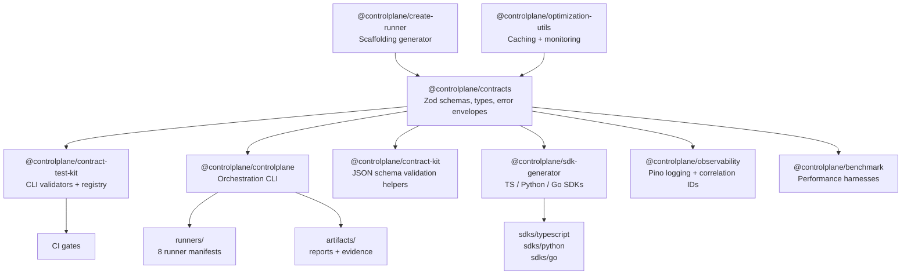

# Architecture

This repository defines the contracts and tooling that ControlPlane-compatible services and runners rely on. It does **not** ship runtime services and does not retain ownership of data or artifacts processed by consuming implementations.

## Package Dependency Graph



### ASCII Fallback

```
                      @controlplane/contracts
                    (Zod schemas + types + errors)
                               |
          ┌────────────┬───────┼───────┬────────────┬──────────┐
          v            v       v       v            v          v
   contract-test-kit  controlplane  contract-kit  sdk-generator  observability
   (CLI validators)   (plan/run/    (JSON schema  (TS/Py/Go     (pino logging)
                       doctor CLI)   helpers)      SDK gen)
          |            |                  |
          v            v                  v
     CI gates     runners/            sdks/
                  (8 manifests)       (generated)
                       |
                       v
                  artifacts/
                  (reports + evidence)
```

## Core Packages

### `@controlplane/contracts` — Source of Truth

- **Location:** `packages/contracts/`
- Canonical Zod schemas and TypeScript types for all ControlPlane APIs.
- Error envelope utilities (`{code, message, details?}`).
- Contract versioning rules (semver-based, additive within major).
- Every other package in this repo depends on this one.

### `@controlplane/contract-test-kit` — Validation CLIs

- **Location:** `packages/contract-test-kit/`
- CLI binaries: `contract-test`, `contract-sync`, `capability-registry`, `marketplace`.
- Validates runner manifests, schemas, and contract sync state.
- Produces compatibility reports for CI pipelines.

### `@controlplane/controlplane` — Orchestration CLI

- **Location:** `packages/controlplane/`
- Commands: `plan` (dry-run execution plan), `run` (invoke runners), `doctor` (health check).
- Discovers runner manifests from `runners/` directory.
- Validates runner outputs (reports + evidence) against contract schemas.
- Writes artifacts to `artifacts/<runner>/<timestamp>/`.

### `@controlplane/create-runner` — Runner Scaffolding

- **Location:** `packages/create-runner/`
- Interactive CLI (`create-runner`) to generate new runner implementations.
- Templates: `http-connector`, `queue-worker`.
- Produces correct contract imports and test stubs.

### `@controlplane/sdk-generator` — SDK Generation

- **Location:** `packages/sdk-generator/`
- Generates TypeScript, Python, and Go SDKs from contract schemas.
- Output: `packages/sdk-generator/sdks/{typescript,python,go}/`.

### `@controlplane/observability` — Logging & Correlation

- **Location:** `packages/observability/`
- Pino-based structured logging with correlation ID propagation.
- Shared observability contract for all ControlPlane services.

### `@controlplane/benchmark` — Performance Testing

- **Location:** `packages/benchmark/`
- Benchmark harnesses for contract validation, queue, health, latency, and scale.
- CLI: `cp-benchmark`.

### `@controlplane/optimization-utils` — Utilities

- **Location:** `packages/optimization-utils/`
- Caching, hardening, and monitoring helpers.

## Supporting Directories

| Directory | Purpose |
|---|---|
| `contracts/` | JSON Schema files (reports, evidence, runner manifest, events, audit-trail, module manifest, CLI) |
| `runners/` | Runner manifest files (8 runners: JobForge, truthcore, aias, autopilot-suite, finops/growth/ops/support-autopilot) |
| `scripts/` | Validation, diagnostics, release, secret scanning, compatibility matrix generation |
| `config/` | OSS/cloud distribution flags |
| `tests/` | E2E (Playwright), integration, golden-fixture tests |
| `benchmarks/` | Performance benchmark definitions |

## Data Flow

### Plan Phase (`controlplane plan`)

1. Scan `runners/` for `runner.manifest.json` files.
2. Validate each manifest against `contracts/runner.manifest.schema.json`.
3. Check SDK exports and schema presence.
4. Output a JSON execution plan with ordered steps.

### Run Phase (`controlplane run`)

1. Load execution plan.
2. Invoke each runner's entrypoint with golden fixture input.
3. Validate each runner's report against `contracts/reports.schema.json`.
4. Validate each runner's evidence against `contracts/evidence.schema.json`.
5. Write artifacts to `artifacts/<runner>/<timestamp>/`.
6. Produce aggregate summary.

### Validation Phase (CI)

1. `contracts:check` validates all manifests + schemas.
2. `compat:check` detects version drift across ecosystem.
3. `distribution:verify` enforces OSS/cloud feature boundaries.
4. `lint` + `typecheck` + `test` run across all packages via Turborepo.

## Build System

- **Turborepo** orchestrates builds across the monorepo.
- **tsup** bundles TypeScript packages (ESM + CJS + DTS).
- **Vitest** runs unit tests.
- **Playwright** runs E2E tests against the local Docker stack.
- Build order respects workspace dependencies (`^build` in turbo.json).

## Extension Points

See [EXTENSION-GUIDE.md](./EXTENSION-GUIDE.md) for step-by-step instructions on:

- Adding a new runner
- Adding a new connector
- Adding a new validation rule
- Extending contract schemas
