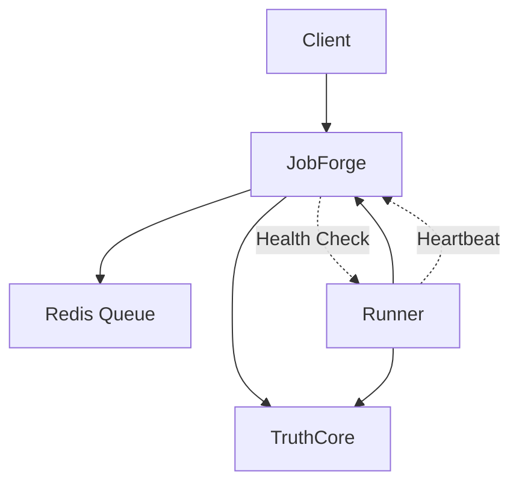

# Compatibility Matrix

This document tracks version compatibility between ControlPlane ecosystem components.

## Current Versions

| Component | Current Version | Contract Version | Status |
|-----------|----------------|------------------|--------|
| `@controlplane/contracts` | 1.0.0 | 1.0.0 | ✅ Active |
| `@controlplane/contract-test-kit` | 1.0.0 | 1.0.0 | ✅ Active |
| TruthCore | 1.0.0 | ^1.0.0 | ✅ Active |
| JobForge | 1.0.0 | ^1.0.0 | ✅ Active |
| Runner-Example | 1.0.0 | ^1.0.0 | ✅ Active |

## Contract Compatibility

### Version Ranges

| Component | Min Contract | Max Contract | Notes |
|-----------|--------------|--------------|-------|
| TruthCore | 1.0.0 | <2.0.0 | Compatible with all v1.x |
| JobForge | 1.0.0 | <2.0.0 | Compatible with all v1.x |
| Runners | 1.0.0 | <2.0.0 | Compatible with all v1.x |

### Breaking Changes

Breaking changes are reserved for **major version bumps** (e.g., 1.x.x → 2.0.0).

When a breaking change occurs:
1. New major version of contracts released
2. Services update independently
3. Migration guide provided
4. Old version supported for 30+ days

## Upgrade Paths

### Safe Upgrade (patch/minor)

```bash
# Update to latest v1.x
npm update @controlplane/contracts

# Run contract tests
npm run test:contracts

# Deploy
```

### Breaking Change Upgrade (major)

```bash
# Update to v2.x
npm install @controlplane/contracts@^2.0.0

# Run migration script (if provided)
npx @controlplane/contracts-migrate

# Update code for breaking changes
# - Handle new required fields
# - Update error handling

# Run full test suite
npm run test
cd orchestrator && pnpm run test:e2e

# Deploy with canary rollout
```

## Service Dependencies



### Dependency Versions

| Service | Depends On | Version Range |
|---------|-----------|---------------|
| JobForge | TruthCore | ^1.0.0 |
| JobForge | Redis | 7.x |
| Runner | JobForge | ^1.0.0 |
| Runner | TruthCore | ^1.0.0 |

## CI Compatibility Gates

The following checks must pass for any release:

1. ✅ Contract tests pass
2. ✅ Schema validation succeeds
3. ✅ E2E tests pass
4. ✅ Smoke tests pass
5. ✅ No breaking changes in minor/patch

## Historical Versions

### 1.0.0 (Initial Release)

- Base contracts established
- Job lifecycle schemas
- Error envelope format
- Runner capability metadata
- Health check standards

---

**Note**: This matrix is automatically updated by CI when versions change.
