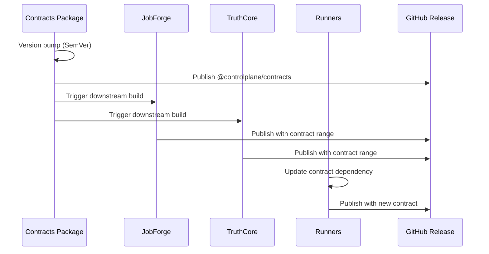

# Release Policy

This document defines the official release policy for the ControlPlane ecosystem, anchored on contract versions to ensure compatibility across all components.

## Release Train Model

ControlPlane follows a **Release Train** model with the following characteristics:

- **Version Anchoring**: All releases are anchored to the `@controlplane/contracts` version
- **Semantic Versioning**: Strict adherence to SemVer (MAJOR.MINOR.PATCH)
- **Breaking Changes**: Only in major releases, with 30-day migration window
- **Release Cadence**: On-demand for patches, monthly for minors, quarterly for majors

## Contract-Anchored Releases

### Version Contract

All components declare their contract compatibility through:

```typescript
interface ContractCompatibility {
  contractVersion: string;      // e.g., "^1.0.0"
  minContract: string;          // e.g., "1.0.0"
  maxContract: string;          // e.g., "<2.0.0"
  breakingChanges: string[];      // List of any breaking changes
}
```

### Release Types

| Type | Description | Contract Anchor | Example |
|------|-------------|-----------------|---------|
| **Contract** | Schema/contract changes | Major/minor bump | `contracts@1.2.0` |
| **Component** | Runner/JobForge/TruthCore updates | Bounded by contracts | `runner@1.3.2` |
| **Platform** | Full ecosystem release | Synchronized versions | `platform@2024.03` |

### Release Sequence



## Semantic Versioning Rules

### Contracts Package

| Change Type | Version Bump | Example |
|-------------|--------------|---------|
| Breaking schema change | Major (x.0.0) | `1.0.0` → `2.0.0` |
| New optional fields | Minor (x.y.0) | `1.0.0` → `1.1.0` |
| Documentation/fixes | Patch (x.y.z) | `1.0.0` → `1.0.1` |

### Components (Runners, JobForge, TruthCore)

| Change Type | Version Bump | Contract Impact |
|-------------|--------------|-----------------|
| Breaking API change | Major (x.0.0) | May require new contract |
| New feature (backward compat) | Minor (x.y.0) | Within contract range |
| Bug fix | Patch (x.y.z) | Within contract range |

## Release Checklist

### Pre-Release

- [ ] All contract tests pass (`pnpm run contract:validate`)
- [ ] Compatibility matrix updated (auto-generated)
- [ ] Changelog generated from conventional commits
- [ ] E2E smoke tests pass
- [ ] Security audit passes
- [ ] Breaking changes documented (if major)
- [ ] Migration guide written (if major)

### Release Process

1. **Prepare**: `pnpm run release:prepare`
   - Generate changelog
   - Update compatibility matrix
   - Create release branch

2. **Validate**: `pnpm run release:validate`
   - Full test suite
   - Contract compatibility check
   - Security scan

3. **Execute**: `pnpm run release:execute`
   - Semantic release automation
   - GitHub release creation
   - NPM publishing

4. **Verify**: `pnpm run release:verify`
   - Post-release smoke tests
   - Compatibility matrix validation

## Compatibility Ranges

### Declaring Compatibility

Each component declares its contract compatibility in `package.json`:

```json
{
  "name": "@controlplane/runner-example",
  "version": "1.2.3",
  "controlplane": {
    "contractCompatibility": {
      "min": "1.0.0",
      "max": "<2.0.0",
      "tested": "1.2.0"
    }
  }
}
```

### Compatibility Levels

| Level | Meaning | Contract Range |
|-------|---------|----------------|
| **Full** | All features supported | `^1.0.0` |
| **Partial** | Core features only | `^1.0.0 <1.5.0` |
| **Deprecated** | Maintenance only | `^1.0.0 <1.2.0` |
| **Incompatible** | Not supported | N/A |

## Breaking Change Policy

### What Constitutes Breaking

- **Contracts**: Removing/requiring fields, changing types
- **APIs**: Removing endpoints, changing request/response shapes
- **Behavior**: Changing default values, removing capabilities

### Breaking Change Process

1. **Announcement**: 30 days before release
2. **Deprecation**: Mark old APIs as deprecated
3. **Migration Guide**: Document upgrade path
4. **Codemod**: Provide automated migration where possible
5. **Release**: Major version bump with breaking changes

### Migration Windows

| Version | Support Duration | Migration Window |
|---------|------------------|------------------|
| Major (N.0.0) | 12 months | 30 days overlap with N+1 |
| Minor (x.Y.0) | Until next major | 14 days overlap |
| Patch (x.y.Z) | Immediate | None |

## Emergency Releases

### Hotfix Process

For critical security or stability issues:

1. Create hotfix branch from latest release tag
2. Apply minimal fix with test
3. Fast-track review (2 approvers required)
4. Immediate release with patch version
5. Merge back to main and next branches

### Criteria for Hotfix

- Security vulnerability (CVE)
- Data loss or corruption risk
- Service unavailability
- Contract validation failures

## Deprecation Policy

### Deprecation Timeline

```
Deprecated -> Maintenance -> End of Life
    |              |             |
   3 months     6 months      Remove
```

### Deprecation Notices

- Marked in code with `@deprecated` JSDoc
- Logged as warning when used
- Documented in release notes
- Removed after EOL date

## Automation

### Automated Checks

The following are automated via CI:

- ✅ Conventional commit enforcement
- ✅ Semantic version calculation
- ✅ Changelog generation
- ✅ Compatibility matrix generation
- ✅ Contract drift detection
- ✅ Security audit

### Manual Gates

Require human approval:

- 🔒 Major version releases
- 🔒 Breaking changes
- 🔒 Security hotfixes
- 🔒 Deprecation declarations

## See Also

- [Compatibility Matrix](./COMPATIBILITY.md)
- [Contract Versioning](../packages/contracts/VERSIONING.md)
- [Release Workflows](../.github/workflows/)
